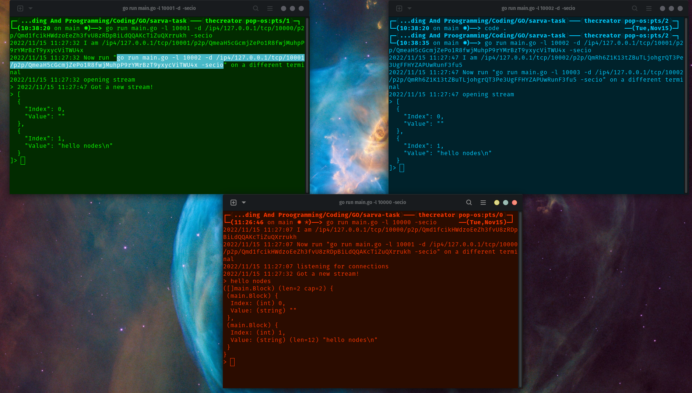

# P2P Network
This is a go project using libp2p for a p2p network and you can connect all the nodes one by one using command line, then whatever data is inserted into one of them it is replicated in all the other nodes

## How to run
+ Open up the terminal and type 
```
go run main.go -l 10000 -secio
```
+ Open two other terminals and type the command that is shown in the first terminal to be types
+ Voila you have your network working


